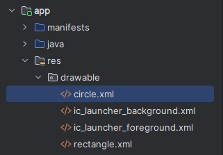
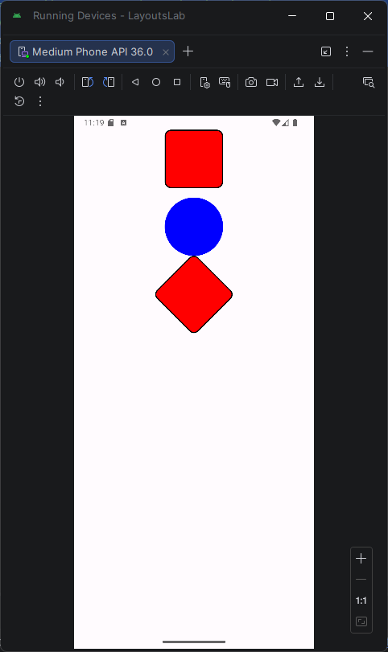
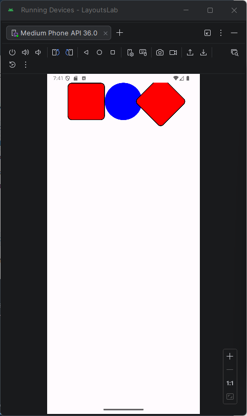
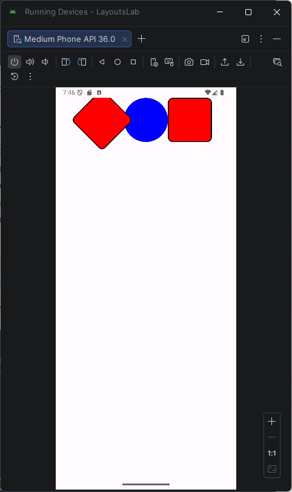
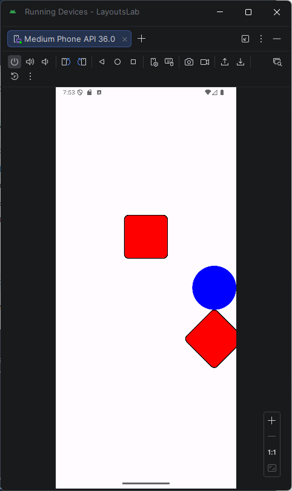
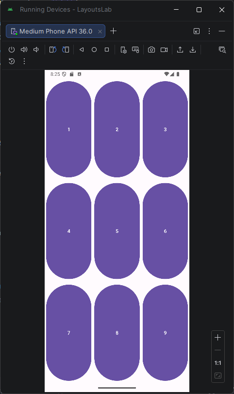
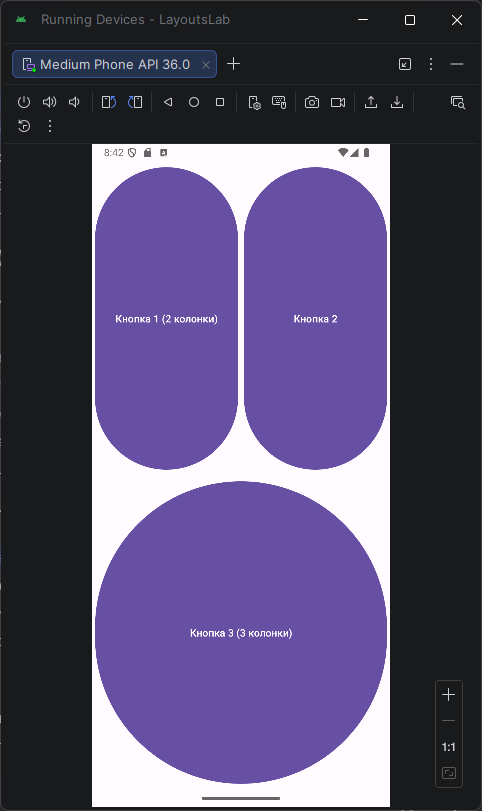
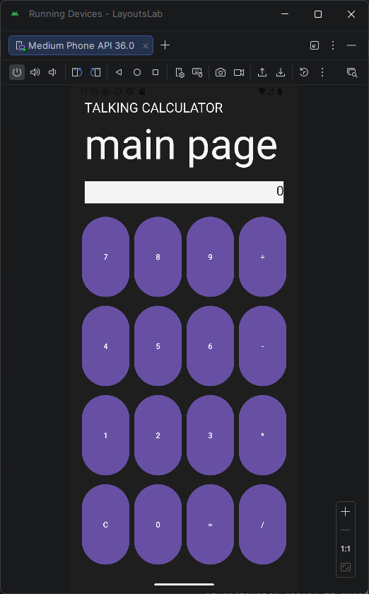

# Практическая работа №2 Основы XML-разметки. Менеджеры размещения LinearLayout и GridLayout
Выполнил: Деревянко Артём Владимирович ИНС-б-о-24-2
Вариант: 11

## Цель работы
Изучить основы языка разметки XML для описания пользовательского интерфейса Android-приложений. Научиться использовать менеджеры размещения (контейнеры) LinearLayout и GridLayout для создания сложных экранов. Освоить основные атрибуты View и создание простых Drawable-ресурсов.

## Ход работы
### Задание 1: Создание проекта и подготовка ресурсов
  1. Был создан новый проект с шаблоном Empty Views Activity под названием `LayoutsLab`.
  2. В папке `res/drawable` созданы два файла: `rectangle.xml` и `circle.xml` (правой кнопкой на drawable → New → Drawable Resource File).<br>
  
  3. Файлы были заполнены содержимым, как показано в теоретической части (для прямоугольника и круга).
  #### Содержимое файла `rectangle.xml`
  ```xml
  <?xml version="1.0" encoding="utf-8"?>
  <shape xmlns:android="http://schemas.android.com/apk/res/android"
    android:shape="rectangle">
    <solid android:color="#FF0000" />
    <corners android:radius="10dp" />
    <stroke android:width="2dp" android:color="#000000" />
  </shape>
  ```
  #### Содержимое файла `circle.xml`
  ```xml
  <?xml version="1.0" encoding="utf-8"?>
  <shape xmlns:android="http://schemas.android.com/apk/res/android"
    android:shape="oval">
    <solid android:color="#0000FF" />
    <size android:width="100dp" android:height="100dp" />
  </shape>
  ```

### Задание 2: Работа с LinearLayout
  1. Был открыт файл `activity_main.xml`. `ConstraintLayout` заменён на `LinearLayout`.
  2. Создан вертикальный `LinearLayout` с тремя `ImageView`, отображающими созданные drawble-ресурсы
  3. Приложение было запущено для проверки корректности отображения фигур.<br>
  

### Задание 3: Изменение ориентации и выравнивания
  1. `android:orientation` изменено на `horizontal`. Расположение элементов с вертикального изменилось на горизонтальное.<br>
  
  2. К `LinearLayout` добавлен атрибут `android:layoutDirection="rtl"`. Элементы выстроились справа налево.<br>
  
  3. Ориентация возвращена на вертикальную. `android:gravity` у родителя был изменён на `center_vertical`, а `android:layout_gravity` у первого дочернего элемента на `center_horizontal`. Действия атрибутов суммируются. Родитель толкает элемент в центр по вертикали, а сам элемент становится по центру по горизонтали.<br>
  

### Задание 4: Работа с GridLayout
  1. Создан новый XML-файл разметки `activity_grid.xml`.
  2. Использован `GridLayout` для создания таблицы кнопок 3x3.
  #### Содержимое файла `activity_grid.xml`
  ```xml
  <?xml version="1.0" encoding="utf-8"?>
  <GridLayout
    xmlns:android="http://schemas.android.com/apk/res/android"
    android:id="@+id/main"
    android:layout_width="match_parent"
    android:layout_height="match_parent"
    android:columnCount="3"
    android:rowCount="3"
    android:padding="16dp">

    <Button
        android:layout_width="0dp"
        android:layout_height="0dp"
        android:layout_columnWeight="1"
        android:layout_rowWeight="1"
        android:text="1"
        android:layout_margin="4dp"/>

    <Button
        android:layout_width="0dp"
        android:layout_height="0dp"
        android:layout_columnWeight="1"
        android:layout_rowWeight="1"
        android:text="2"
        android:layout_margin="4dp"/>

    <Button
        android:layout_width="0dp"
        android:layout_height="0dp"
        android:layout_columnWeight="1"
        android:layout_rowWeight="1"
        android:text="3"
        android:layout_margin="4dp"/>

    <Button
        android:layout_width="0dp"
        android:layout_height="0dp"
        android:layout_columnWeight="1"
        android:layout_rowWeight="1"
        android:text="4"
        android:layout_margin="4dp"/>

    <Button
        android:layout_width="0dp"
        android:layout_height="0dp"
        android:layout_columnWeight="1"
        android:layout_rowWeight="1"
        android:text="5"
        android:layout_margin="4dp"/>

    <Button
        android:layout_width="0dp"
        android:layout_height="0dp"
        android:layout_columnWeight="1"
        android:layout_rowWeight="1"
        android:text="6"
        android:layout_margin="4dp"/>

    <Button
        android:layout_width="0dp"
        android:layout_height="0dp"
        android:layout_columnWeight="1"
        android:layout_rowWeight="1"
        android:text="7"
        android:layout_margin="4dp"/>

    <Button
        android:layout_width="0dp"
        android:layout_height="0dp"
        android:layout_columnWeight="1"
        android:layout_rowWeight="1"
        android:text="8"
        android:layout_margin="4dp"/>

    <Button
        android:layout_width="0dp"
        android:layout_height="0dp"
        android:layout_columnWeight="1"
        android:layout_rowWeight="1"
        android:text="9"
        android:layout_margin="4dp"/>
  </GridLayout>
  ```
  3. Временно заменено `setContentView` в MainActivity.<br>
  

### Задание 5: Объединение ячеек в GridLayout
  В Задании 5 реализовано объединение ячеек в GridLayout с использованием атрибутов layout_columnSpan и layout_row. Кнопка 1 занимает два столбца первой строки, Кнопка 2 — оставшийся столбец, Кнопка 3 — всю ширину второй строки. Это демонстрирует возможность создания сложных сеточных интерфейсов с неравномерным распределением элементов.<br>
  

### Задание для самостоятельного выполнения
  Используя менеджеры размещения `LinearLayout` (основной) и `GridLayout` (для клавиатуры), создана композиция из кнопок.<br>
  

## Вывод
В ходе лабораторной работы были изучены основы языка разметки XML для описания пользовательского интерфейса Android-приложений. Получены навыки работы с менеджерами размещения (контейнерами) LinearLayout и  ridLayout для создания сложных экранов. Освоены основные атрибуты View и создание простых Drawable-ресурсов.

## Ответы на контрольные вопросы
**1. Что такое XML? Для каких целей он используется в Android-разработке?**<br>
XML (eXtensible Markup Language) — язык разметки для декларативного описания пользовательского интерфейса. В Android используется для создания layout-файлов (интерфейса экранов), описания стилей, строк, цветов и других ресурсов.<br><br>

**2. Что такое тег (элемент) в XML? Из каких частей он состоит?**<br>
Тег — это базовый элемент XML. Состоит из:
- Имени тега (например, `<LinearLayout>`)
- Атрибутов с значениями (android:layout_width="match_parent")
Открывающей и закрывающей части (`<TextView>...</TextView>`)<br><br>

**3. Какие менеджеры размещения (контейнеры) вы знаете?**<br>
- LinearLayout — располагает элементы в ряд (горизонтально/вертикально)
- GridLayout — располагает элементы в виде сетки (строки × столбцы)
- ConstraintLayout — гибкое позиционирование относительно других элементов
- RelativeLayout — позиционирование относительно родителя или других элементов
- FrameLayout — размещает элементы слоями друг над другом<br><br>

**4. В чём разница между LinearLayout и GridLayout?**<br>
- LinearLayout — элементы в одну линию (вертикально/горизонтально). Удобно для простых списков, форм.
- GridLayout — элементы в сетке с строками и столбцами. Удобно для калькуляторов, клавиатур, таблиц.<br><br>

**5. Что такое match_parent и wrap_content?**<br>
- match_parent — элемент занимает всё доступное пространство родителя
- wrap_content — элемент занимает только необходимое место для содержимого
- Пример: кнопка с `wrap_content` будет ровно по размеру текста, а с `match_parent` — на всю ширину экрана.<br><br>

**6. В чём разница между android:gravity и android:layout_gravity?**<br>
- android:gravity — выравнивание содержимого внутри View (например, текста в кнопке)
- android:layout_gravity — выравнивание самой View внутри родительского контейнера<br><br>

**7. Какие единицы измерения используются в Android?**<br>
- px — пиксели (редко используется)
- dp (density-independent pixels) — для размеров View (не зависит от плотности экрана)
- sp (scale-independent pixels) — для размеров текста (учитывает масштабирование пользователем)<br><br>

**8. Как создать простую фигуру с помощью XML-ресурса в drawable?**<br>
Создать XML-файл в `res/drawable/` с тегом `<shape>`:<br><br>
Прямоугольник:
```xml
<shape android:shape="rectangle">
    <solid android:color="#FF0000"/>
    <corners android:radius="10dp"/>
</shape>
```
Круг:
```xml
<shape android:shape="oval">
    <solid android:color="#0000FF"/>
    <size android:width="100dp" android:height="100dp"/>
</shape>
```
